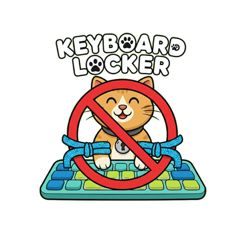

# Keyboard Locker


A simple, effective utility for Linux to lock your keyboard input while keeping your screen visible and the system running.

## Use Cases

* **Cat Proofing:** Stop your cat from walking across your keyboard and sending unfinished emails, closing windows, or pausing your music.
* **Disable Laptop Keyboard:** If you are using another keyboard disable the internal laptop one to prevent accidental keypresses.
* **Child Safety:** Allow your toddler to watch videos or look at photos without worrying about them accidentally deleting files or stopping playback.
* **Cleaning:** Wipe down your keyboard without needing to shut down your computer or unplug the device.

## Features

* **System-Level Lock:** Uses `evdev` to grab the keyboard device directly, ensuring input is blocked for all applications.
* **Configurable Unlock:** Set your own unlock key combination (Default: `CTRL + Q`).
* **Visual Indicator:** Clear GUI feedback showing when the keyboard is locked.
* **Wayland & X11 Support:** Works independently of the display server by interacting with kernel input devices.

## Installation

### Arch Linux

A `PKGBUILD` is provided for easy installation on Arch Linux.

```bash
makepkg -si
```

reload the udev rules after install

``` bash
sudo udevadm control --reload-rules && sudo udevadm trigger --subsystem-match=input --action=change 
```

If you aren't in the input group add your user

```bash
sudo usermod -aG input $USER
```

### Other Linux Distributions (Debian, Ubuntu, Fedora, etc.)

You can build and install the application manually using the provided script.

#### 1. Install Dependencies

You will need the Rust toolchain (`cargo`) and development libraries for Wayland and OpenGL.

**Debian / Ubuntu / Mint:**

```bash
sudo apt update
sudo apt install build-essential libxkbcommon-dev libwayland-dev libglvnd-dev pkg-config libssl-dev policykit-1
curl --proto '=https' --tlsv1.2 -sSf https://sh.rustup.rs | sh
```

**Fedora / RHEL:**

```bash
sudo dnf install gcc libxkbcommon-devel wayland-devel libglvnd-devel openssl-devel polkit
curl --proto '=https' --tlsv1.2 -sSf https://sh.rustup.rs | sh
```

#### 2. Build and Install

Clone the repository and run the install script:

```bash
chmod +x install.sh
./install.sh
```

This script will compile the application, install it to `/usr/local/bin`, and install a udev rule to allow running without root.

If you aren't in the input group add your user

```bash
sudo usermod -aG input $USER
```

## Usage

1. Open your application menu and launch **Keyboard Locker**.
2. The application should open immediately (no password required).
3. Once the window opens, you can optionally change the unlock key (Default is `Q`).
4. Click **🔒 LOCK NOW**.
5. Your keyboard is now locked. To unlock, press `Left Ctrl` + `[Your Configured Key]` (e.g., `Ctrl + Q`).

## Uninstallation

If you installed via the `install.sh` script, you can remove the files manually:

```bash
sudo rm /usr/local/bin/keyboard-locker
sudo rm /usr/share/pixmaps/keyboard-locker.png
sudo rm /usr/share/applications/keyboard-locker.desktop
sudo rm /etc/udev/rules.d/99-keyboard-locker.rules
```

## Troubleshooting

### ⚠ No Keyboards Detected

If the application launches but the dropdown is empty or shows a warning, it is likely a permission issue. The application needs direct access to /dev/input/ devices

Fix:

1. Add your user to the input group:

```bash
sudo usermod -aG input $USER
```

2. Reboot your computer.

Note: Simply logging out and back in is often insufficient for device node permissions to update.

### 🔒 Lock Failed / Device Busy

If you click "LOCK NOW" and it immediately unlocks or shows an error:

* **Exclusive Access**: Another application may have already "grabbed" the device.
* **Device State**: The keyboard might have disconnected or changed paths (e.g., KVM switch toggled). Try re-selecting the device from the dropdown.

### 🔑 Cannot Unlock

If the unlock combination is not working:

1. Ensure you are holding **CTRL** (Left or Right) while pressing the configured key.
2. The default key is **Q** (i.e., `CTRL + Q`).
3. If you customized the key (e.g., to 'X'), use `CTRL + X`.
4. **Emergency Unlock**: Unplugging the keyboard will force the application to release the handle. You can then plug it back in to use it normally.

### Wayland vs X11

This application uses `evdev` (kernel-level input drivers). This means it works on **Wayland** (GNOME, Sway, Hyprland) where traditional X11 screen lockers or input blockers often fail.
